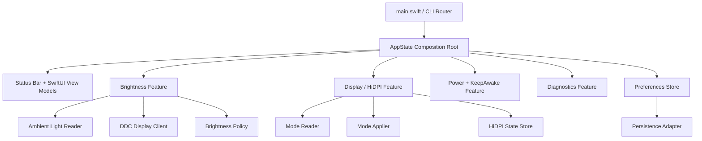

# AmbientSync Mimari Parcalama ve Teknik Borc Haritasi

Bu planin amaci mevcut calisan yapiyi yikmadan, davranisi sabitleyerek ve kucuk adimlarla AmbientSync'i daha bakimi kolay bir mimariye tasimaktir. Ana prensip: once olcum ve sinirlar, sonra tasima, en son sadeleştirme.

## Mevcut Durum Ozeti

- Uygulama Swift Package olarak tek executable target uzerinden calisiyor.
- `main.swift` hem CLI tanilama komutlarini hem de macOS status bar uygulama baslatmasini yonetiyor.
- `AppState` / `AppDelegate.swift` uygulamanin ana orkestratoru ve ayni anda UI state, polling, sensor okuma, DDC brightness, volume routing, keep-awake, HiDPI, LaunchAgent, calibration ve diagnostic akislarini tasiyor.
- `DisplayControl` klasoru belirgin sekilde parcalanmaya baslamis; HiDPI, EDID ve brightness diagnostic kodlari ayri dosyalara ayrilmis.
- `Preferences/AmbientSyncModels.swift` hem domain modellerini hem de `UserDefaults` tabanli store'u beraber tutuyor.
- Test hedefi yok. `swift test` build'i tamamliyor ancak `Tests` dizini olmadigi icin test calismiyor.

## Mimari Hedef

Hedef mimari, `AppState`'i ince bir composition root ve UI binding noktasi olarak birakip is kurallarini servis/modul sinirlarina tasimaktir.



## Teknik Borc Haritasi

| Alan | Belirti | Risk | Oncelik | Ilk Cozum |
| --- | --- | --- | --- | --- |
| God object | `AppDelegate.swift` 2300+ satir ve cok fazla sorumluluk | Degisiklikler yan etki uretir, test etmek zorlasir | P0 | Feature coordinator'lara parca parca tasima |
| Test eksikligi | `Tests` hedefi yok | Refactor davranis regresyonu yaratabilir | P0 | Karakterizasyon testleri ve pure function testleri |
| CLI/App karisikligi | `main.swift` CLI diagnostic ve GUI lifecycle'i beraber yonetiyor | Yeni komut eklemek GUI baslatma davranisini bozabilir | P1 | `CommandRouter` veya `DiagnosticCommandRunner` ayirmak |
| Kalicilik daginikligi | `UserDefaults.standard` birden fazla yerde dogrudan kullaniliyor | Key carpismasi, migration zorlugu | P1 | `PreferencesRepository` ve typed defaults keys |
| Donanim bagimliligi | `m1ddc`, IOKit, CGS ve private API cagri noktalarinin bir kismi yuksek seviyeye siziyor | Mock/test zor, cihaz yokken gelistirme yavas | P1 | Protocol tabanli adapter sinirlari |
| Polling akisi | `tick()` sensor, display lookup, brightness policy, write, diagnostic ve UI update'i beraber yapiyor | Zamanlama buglari ve manuel override davranisi kirilgan | P0 | `BrightnessAutoController` state machine |
| UI ve domain coupling | SwiftUI view'lar dogrudan `AppState` fonksiyonlarina yaslaniyor | UI degisikligi domain davranisini etkileyebilir | P2 | Feature-specific view model facadeleri |
| Diagnostic kod buyumesi | Diagnostic runner, reporter ve UI state ayni app state'e baglaniyor | Deneysel kod urun akisina karisir | P2 | `DiagnosticsFeature` altinda komut/report siniri |
| LaunchAgent sorumlulugu | plist yazma ve menu state ayni yerde | Startup/login refactorlari riskli | P2 | `LaunchAgentService` |
| Build artifaktlari | `AmbientSync.app`, log ve generated docs repo kokunde | Kaynak/artifakt ayrimi bulanik | P3 | Artifact policy ve `.gitignore`/release klasoru duzeni |

## Parcalama Stratejisi

### Faz 0: Guvenlik Agi ve Envanter

Hedef: Kod davranisini degistirmeden refactor icin guvenli zemin kurmak.

- `Tests/AmbientSyncTests` hedefi ekle.
- Once saf fonksiyonlari test et: `BrightnessCurve`, `LuxFilter`, `DDCBrightnessScale`, EDID parser, defaults migration.
- `swift build` ve `swift test` komutlarini tek dogrulama kapisi yap.
- Mevcut diagnostic komutlarini smoke-test listesine al: `--diagnostic`, `--hidpi-mode-pool-diagnostic`, `--cgs-mode-enumeration`.
- Riskli donanim aksiyonlari icin dry-run/test double yaklasimini belirle; gercek DDC/CGS write testleri manuel kabul kapisinda kalsin.

Kabul kriteri:

- Test target var.
- Pure logic testleri geciyor.
- GUI app davranisi degismeden build aliniyor.

### Faz 1: AppState'i Composition Root'a Indirme

Hedef: `AppState` icinden ilk olarak yan etkisi dusuk, siniri net sorumluluklari cikarmak.

- `LaunchAgentService` olustur: install, uninstall, status, plist path hesaplama.
- `StatusBarPresenter` veya `StatusBarController` genisletmesi olustur: status item image/title/tooltip ve menu title update'leri.
- `KeepAwakeFeatureController` olustur: state persistence, wake event, lifecycle refresh ve action metotlari.
- `VolumeFeatureController` olustur: volume read/write/mute, last non-zero state ve route banner tetikleme.

Kabul kriteri:

- `AppState` public UI action yuzeyi korunur; view kodlari kirilmaz.
- Cikarilan servisler once `AppState` tarafindan kullanilir, davranis ayni kalir.
- Her tasima sonrasi `swift build` gecmelidir.

### Faz 2: Brightness Otomasyonunu State Machine'e Ayirma

Hedef: `tick()` metodunu kucultmek ve brightness kararlarini test edilebilir hale getirmek.

- `BrightnessAutoController` ekle.
- Girdi modeli tanimla: lux, display, profile, calibration, current readback, manual override state, timing.
- Cikti modeli tanimla: write request, suppression reason, diagnostic snapshot, UI status text.
- `ManualBrightnessOverridePolicy` ayir.
- `BrightnessDiagnosticSnapshotBuilder` ayir.
- `M1DDCWriter` icin protokol cikart: `DisplayControlClient`.

Kabul kriteri:

- `tick()` yalnizca veri toplama, controller cagrisi ve sonucu uygulama isini yapar.
- Target calculation, debounce, suppression ve limiter cooldown testlenebilir.
- Manuel brightness override davranisi snapshot test/characterization test ile korunur.

### Faz 3: HiDPI ve Diagnostic Akislarini Facade Altina Alma

Hedef: UI'daki HiDPI action'lari ile display-mode domain kodu arasina tek giris kapisi koymak.

- `HiDPIFeatureController` olustur.
- `reloadDisplayModes`, `refreshCGSModeSwitcherState`, `maybeAutoReapplyHiDPI`, `setHiDPIEnabled`, `applyCGSMode*` action'lari bu controller'a tasinir.
- Deneysel CGS/private activation kodlari `ExperimentalDiagnostics` namespace/klasoru altinda tutulur ve urun akisindan acikca ayrilir.
- `docs/hidpi_target_architecture.md` ile uyum korunur: resolver, reader, applier, state store, reapply service sinirlari bozulmaz.

Kabul kriteri:

- AppState yalnizca published UI state'i gunceller veya facade'dan state snapshot alir.
- HiDPI mode apply aksiyonlari tek controller uzerinden izlenebilir.
- Emergency reset ve disable akislarinin manuel test checklist'i guncellenir.

### Faz 4: Preferences ve Persistence Katmanini Temizleme

Hedef: `UserDefaults.standard` kullanimlarini typed repository arkasina almak.

- `PreferencesRepository` ekle.
- Key'leri tek yerde topla: app preferences, keep awake, status bar detail, last volume, HiDPI state.
- Migration fonksiyonlarini model dosyasindan ayir.
- `AmbientSyncStore` sadece observable state ve domain update metotlariyla kalsin.

Kabul kriteri:

- Yeni defaults key ekleme tek dosyadan yapilir.
- Migration testleri vardir.
- Eski kullanici ayarlari bozulmadan okunur.

### Faz 5: Modul Sinirlarini Netlestirme

Hedef: Kod organizasyonunu feature-first ve adapter/domain ayrimi ile kalici hale getirmek.

Onerilen klasor duzeni:

```text
Sources/AmbientSync/
  App/
    AppState.swift
    AppLifecycle.swift
    CommandRouter.swift
  Features/
    Brightness/
      BrightnessAutoController.swift
      BrightnessPolicies.swift
      BrightnessViewModel.swift
    Display/
      HiDPIFeatureController.swift
      DisplayControlClient.swift
    KeepAwake/
      KeepAwakeFeatureController.swift
    Volume/
      VolumeFeatureController.swift
    Diagnostics/
      DiagnosticCommandRunner.swift
  Infrastructure/
    Persistence/
      PreferencesRepository.swift
      DefaultsKeys.swift
    System/
      LaunchAgentService.swift
      PowerSourceController.swift
    Hardware/
      M1DDCWriter.swift
      AmbientLightReader.swift
  UI/
    MenuBar/
    Settings/
```

Kabul kriteri:

- Feature kodu kendi domain modeli ve controller'i ile okunabilir.
- Hardware adapter'lari feature policy kodundan ayridir.
- `AppState` hedefi 300-500 satir bandina iner.

## Uygulama Sirasi

1. Test target ve ilk pure logic testleri.
2. LaunchAgent ve status bar title/image islerinin cikartilmasi.
3. KeepAwake controller ayrimi.
4. Volume controller ayrimi.
5. Brightness state machine ve protocol adapter.
6. HiDPI facade.
7. Preferences repository.
8. Klasor duzeni ve isimlendirme temizligi.

## Refactor Kurallari

- Her PR/commit tek sorumluluk tasimali.
- UI davranisi degisecekse once mevcut davranis snapshot olarak yazilmali.
- Donanim yazan aksiyonlar varsayilan olarak mock/dry-run ile test edilmeli.
- `AppState`'ten cikarilan her servis once mevcut API'yi koruyarak kullanilmali; UI view'lar ayni anda refactor edilmemeli.
- `UserDefaults` key migration'i olmadan key adi degistirilmemeli.
- Deneysel/private API kodlari urun akisi controller'larina karismamali.

## Olcum Metrikleri

- `AppDelegate.swift` satir sayisi: 2312 -> hedef 500 alti.
- `tick()` boyutu: yaklasik 440 satir -> hedef 80 satir alti.
- Test kapsami: once pure logic, sonra controller karar agaci.
- Dogrudan `UserDefaults.standard` kullanim sayisi: kademeli olarak repository arkasina alinacak.
- Donanim adapter protokolleri: DDC, ambient sensor, display mode apply/read.

## Riskli Noktalar ve Azaltma

- DDC ve CGS davranisi cihaza bagimlidir; otomatik test tek basina yeterli olmayacak. Manuel smoke checklist gerekir.
- HiDPI emergency reset akisi kritik guvenlik kapisidir; refactor sirasinda en son tasinmali veya once karakterizasyon testiyle korunmali.
- Timer/polling davranisi ufak degisikliklere hassastir; `tick()` parcasi tek seferde degil, karar/cikti modeli uzerinden bolunmeli.
- Preferences migration kullanici verisini etkiler; once read-only repository adaptoru, sonra write path tasinmali.

## Ilk Sprint Ciktilari

- `Tests/AmbientSyncTests` eklenmis.
- `BrightnessCurve`, `DDCBrightnessScale`, `EDIDParser` icin ilk testler.
- `LaunchAgentService` ayrilmis.
- `AppState` davranisi korunarak status bar update helper'i ayrilmis.
- Teknik borc panosu icin P0/P1 maddeleri issue veya checklist haline getirilmis.
