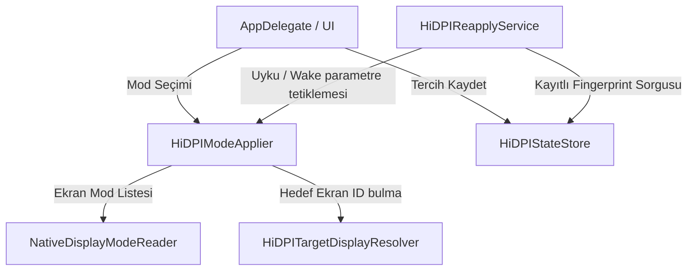

# Native HiDPI Target Architecture

Bu doküman, AmbientSync uygulamasında BetterDisplay veya benzeri üçüncü parti sanal ekran sürücülerine ihtiyaç duymadan, macOS Grafik Sürücü katmanında çalışan native HiDPI ve Smooth Scaling mimarisini açıklar.

## 1. Mimari Prensipler

*   **Sanal Ekran Yok (No Framebuffer/Dummy):** Sistemde sanal bir ekran, ayna (mirror) ekran veya dummy display oluşturulmaz. Bu, GPU ve CPU üzerindeki gereksiz yükleri sıfıra indirir.
*   **Fiziksel Ekran Doğrulama (Target Resolution):** Yalnızca online olan fiziksel harici Samsung ekranın kimliği ve donanım yetenekleri doğrulanır. Dahili ekranlar kesinlikle bu işlemin dışındadır.
*   **Güvenli Mod Yönetimi (Safe Mode Application):** Mod geçişleri macOS'in yerleşik `CGBeginDisplayConfiguration` ve `CGConfigureDisplayWithDisplayMode` API'leri ile gerçekleştirilir. Geçiş hatası durumunda otomatik rollback (geri yükleme) tetiklenir.
*   **State Store & Reapply (Fingerprint-Based):** Kullanıcının tercih ettiği çözünürlük verileri `CGDisplayMode` nesnesi saklanmadan scalar fingerprint (genişlik, yükseklik, piksel boyutu, yenileme hızı vb.) olarak UserDefaults üzerinde saklanır ve uyku uyanma/bağlantı yenilenmesi sonrası 2 saniye debounce süresiyle yeniden basılır.

## 2. Bileşenler ve İş Bölümü

*   **HiDPITargetDisplayResolver:** Dahili ekranları göz ardı ederek online olan Samsung monitörün ID ve donanım bilgilerini çözer.
*   **NativeDisplayModeReader:** macOS'in listelediği tüm çözünürlük modlarını okur ve piksellerin logical boyutlara oranını inceleyerek HiDPI modlarını sınıflandırır.
*   **HiDPIModeApplier:** Mod geçişlerini transactional olarak yönetir. Başarısız geçiş durumunda son çalışan kararlı moda geri döner.
*   **HiDPIStateStore:** Son seçili modu scalar değerlerle kaydeder.
*   **HiDPIReapplyService:** Ekran değişimi, wake ve reconnect sonrasında kararlı geçiş bekler (debounce) ve Samsung monitörün bağlı olup olmadığını kontrol ederek modu geri yükler.
